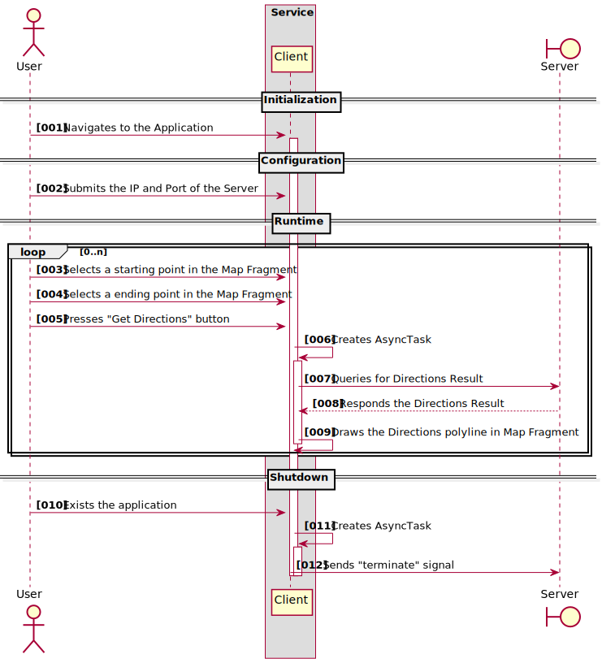

# Directions Map Reduce Client # 

A small project that where the user selects a starting and an ending location in a Google Maps Fragment
and queries an **Directions Map Reduce Server** at the configured ip/port.

## Versions ##

* Compile Android SDK: 30
* Android Build Tools: 30.0.3
* Play Services Maps SDK: 17.0.0
* Play Services Location SDK: 18.0.0

## Sequence Diagram ##

## Build ##

_to be described_

## Run ##

_to be described_
